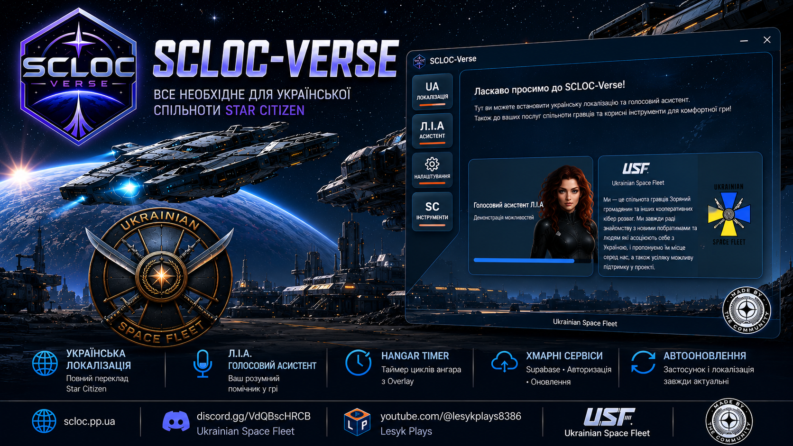
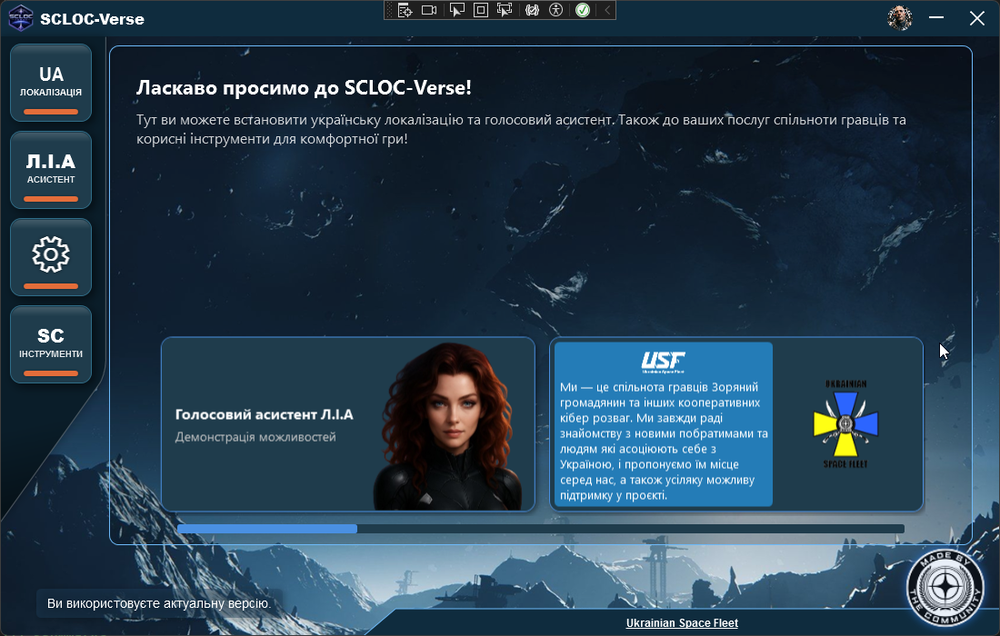
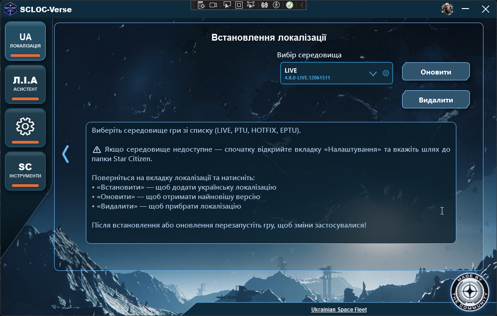
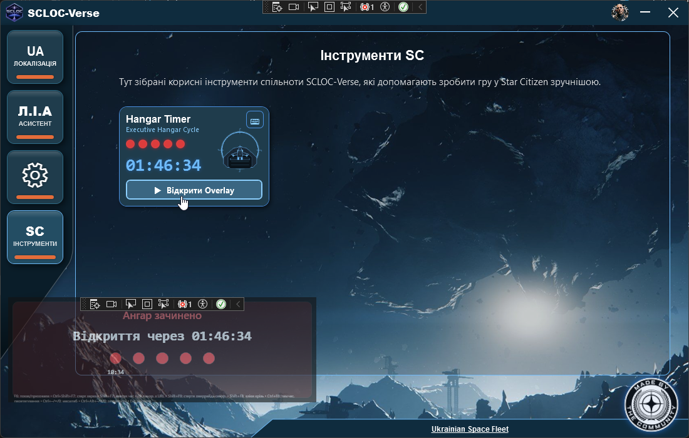
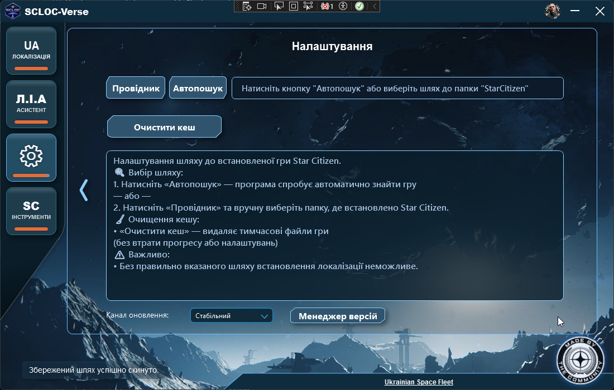
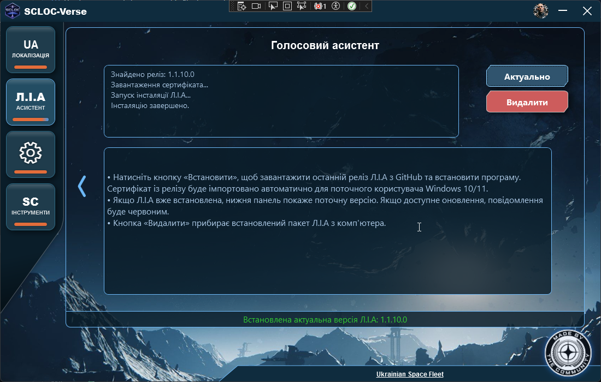

# 🇺🇦 SCLOC-Verse

  

---

# 🌐 Сайт проєкту

**https://scloc.pp.ua**

---

# 🌌 Все необхідне українському пілоту Star Citizen

**SCLOC-Verse** — офіційний застосунок української спільноти **Star Citizen**, який об'єднує в одному місці українську локалізацію, голосового асистента **Л.І.А.**, Executive Hangar Timer, автоматичні оновлення та майбутні онлайн-сервіси спільноти.

---

# ✨ Основні можливості

🇺🇦 **Українська локалізація**

- встановлення в один клік;
- автоматичне оновлення;
- підтримка LIVE, PTU, HOTFIX та EPTU.

---

🎙 **Голосовий асистент Л.І.А.**

- автоматичне встановлення;
- перевірка оновлень;
- автоматичний імпорт сертифіката.

---

🛰 **Executive Hangar Timer**

- Overlay поверх гри;
- глобальні гарячі клавіші;
- масштабування;
- прозорість;
- синхронізація циклів.

---

🔄 **Автоматичні оновлення**

SCLOC-Verse автоматично повідомляє про нові версії застосунку.

---

👤 **Авторизація Discord**

Безпечний вхід через Discord OAuth.

---

📊 **Аналітика**

Допомагає покращувати застосунок без збору поведінкової телеметрії.

---

# 🖼 Інтерфейс

---

# 🚀 Встановлення

1. Завантажте останню версію із **Releases**.

2. Запустіть **SCLOC-Verse_Setup.exe**.

3. Запустіть застосунок.

4. Вкажіть шлях до Star Citizen.

5. Встановіть локалізацію.

> ⚠️ Після встановлення або оновлення локалізації **перезапустіть Star Citizen**.

---

# 🔐 Безпека

SCLOC-Verse:

- ✅ не втручається у процес гри;
- ✅ не використовує DLL Injection;
- ✅ не змінює пам'ять гри;
- ✅ не взаємодіє з античитом;
- ✅ не надає жодних переваг у грі.

Застосунок лише працює з файлами локалізації та допоміжними інструментами.

---

# 🔒 Конфіденційність

SCLOC-Verse поважає вашу приватність.

Застосунок:

- використовує лише Discord OAuth (`identify`);
- не збирає поведінкову телеметрію;
- не відстежує ваші дії;
- зберігає лише службову інформацію про інсталяцію:
  - версію застосунку;
  - платформу;
  - країну (GeoIP);
  - дату останньої активності.

Усі дані захищені Row Level Security (RLS).

---

# ❤️ Підтримати проєкт

Українська локалізація Star Citizen розвивається завдяки спільноті.

Якщо вам подобається SCLOC-Verse — підтримайте розвиток проєкту.

---

# 💬 Спільнота

🎮 Discord

https://discord.gg/VdQBscHRCB

🎥 Відеоінструкція

https://www.youtube.com/watch?v=4AwL8TKXcTU

🌍 Українська локалізація

https://github.com/Vova-Bob/SC_localization_UA

---

# 💙 Подяка

Дякуємо всім учасникам української спільноти Star Citizen, які допомагають розвивати проєкт, тестують нові можливості, знаходять помилки та підтримують його розвиток.

Саме завдяки вам SCLOC-Verse продовжує ставати кращим.

---

# 👨‍💻 Автори

## VALDEUS (Vova-Bob)

Автор SCLOC-Verse.

Розвиток проєкту, архітектура, програмна реалізація, інфраструктура, українська локалізація Star Citizen та подальша підтримка.

## AlexLiberty (Alexuß)

Співавтор SCLOC-Verse.

Початковий дизайн застосунку, початковий каркас проєкту та автор голосового асистента Л.І.А.

---

# 📜 Ліцензія

SCLOC-Verse поширюється за ліцензією **MIT**.

Українська локалізація Star Citizen та голосовий асистент **Л.І.А.** мають власні умови використання відповідних проєктів.
